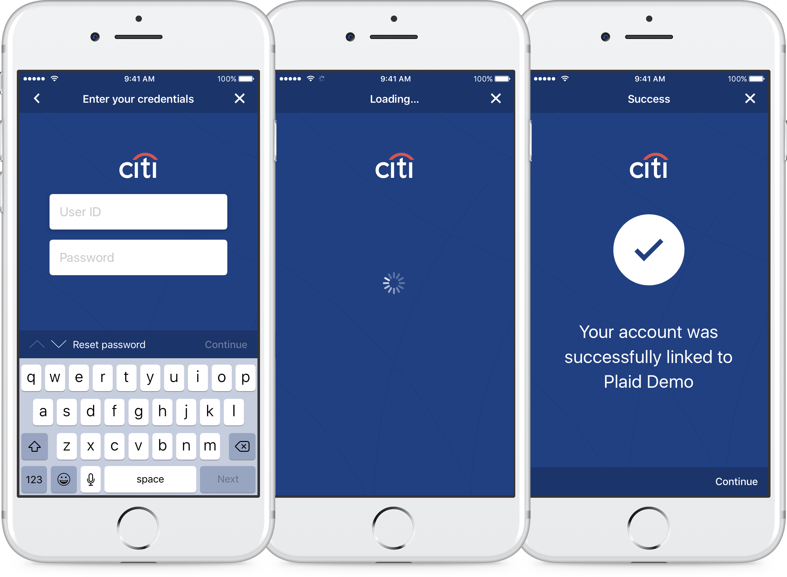
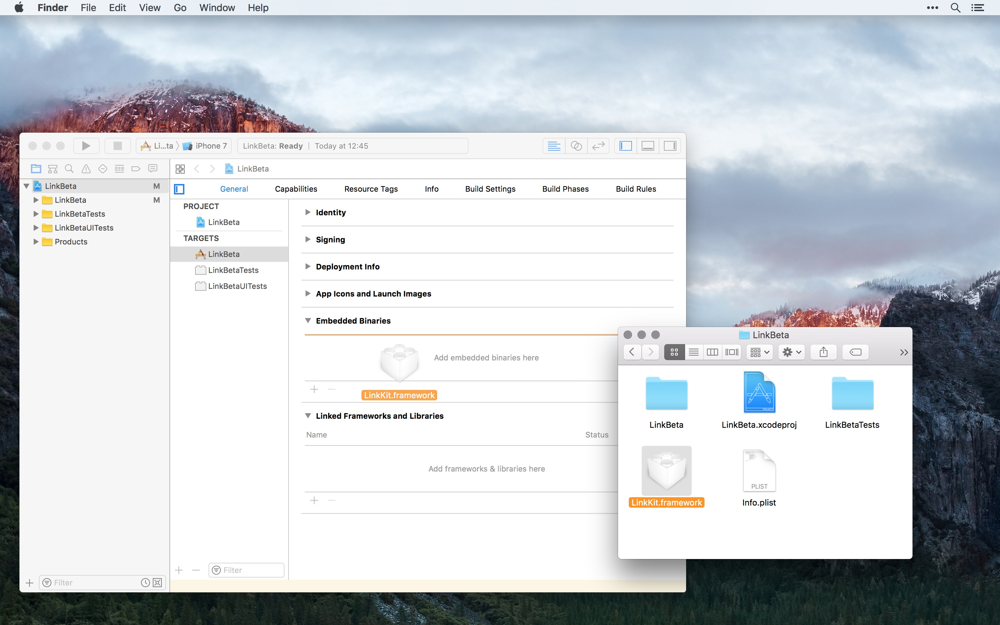
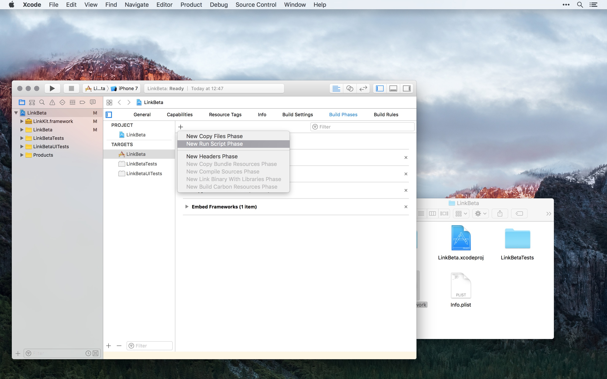
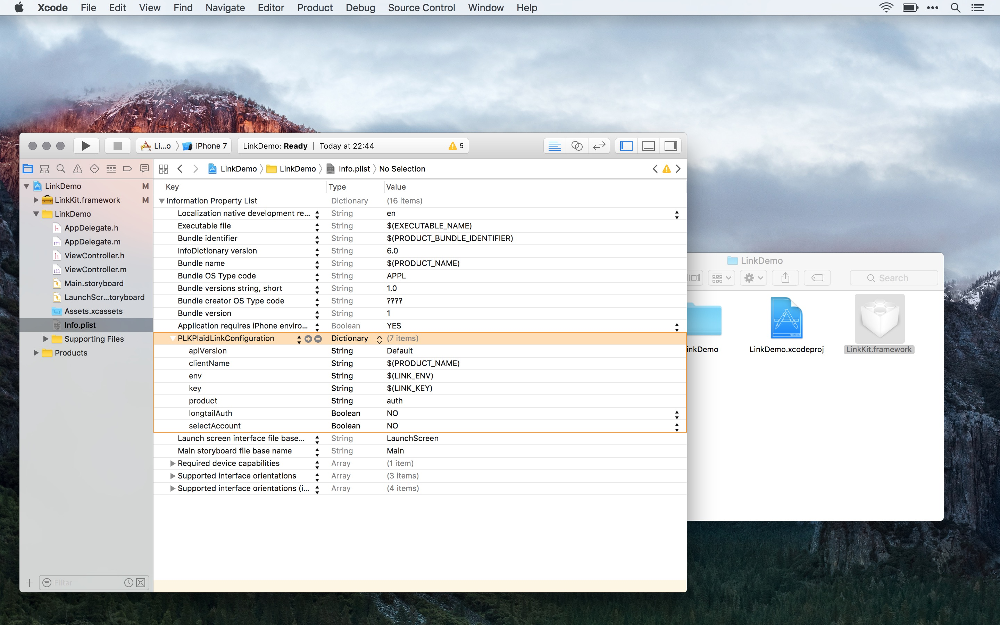
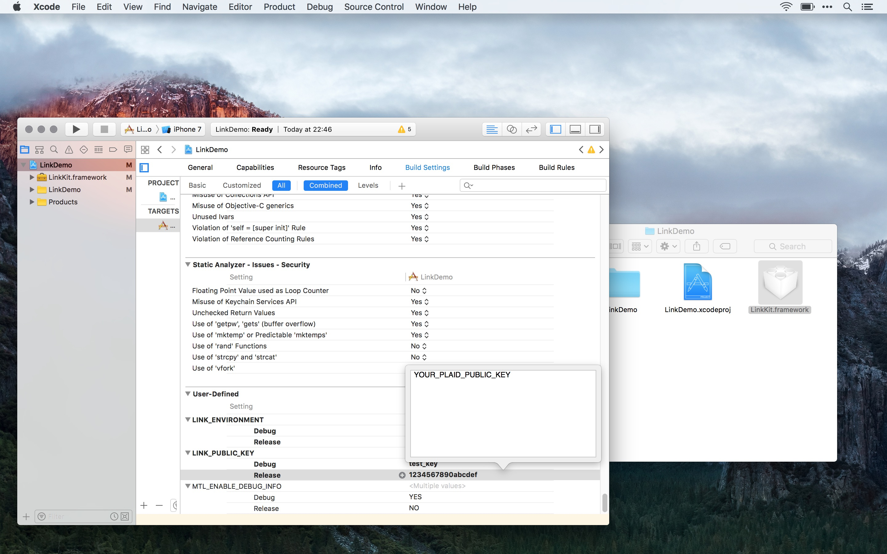
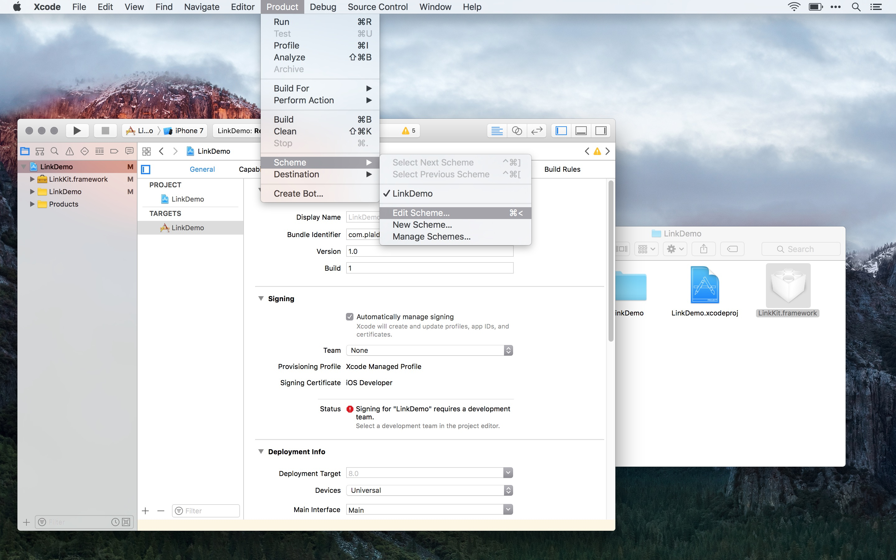
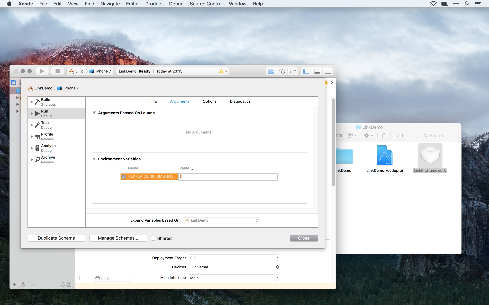

# Link iOS

Welcome to the Plaid Link iOS!

In this repository you find instructions and sample applications in
[Objective-C](LinkDemo-ObjC), [Swift](LinkDemo-Swift) and [Swift 2](LinkDemo-Swift2) (requires Xcode 7)
that demonstrate Plaid Link for iOS. At the center of it all lies [`LinkKit.framework`][linkkit]
an embeddeable framework managing the details of linking an account with Plaid.

Here are some screenshots of the user interface provided by Plaid Link iOS:



## Table of Contents

* [link-ios](#link-ios)
  * [Preparation](#preparation)
  * [Requirements](#requirements)
  * [Quick Guide for The Impatient (TL;DR)](#quick-guide-for-the-impatient)
  * [Getting Started](#getting-started)
    * [Integration](#integration)
    * [Configuration](#configuration)
    * [Implementation](#implementation)
      * [Objective-C](#objective-c)
      * [Swift](#swift)
    * [Troubleshooting](#troubleshooting)
  * [Custom Initializers](#user-content-custom-initializer-info)
    ([Objective-C](#user-content-objc-custom-initializer), [Swift](#user-content-swift-custom-initializer))
  * [Update Mode](#user-content-update-mode-info)
    ([Objective-C](#user-content-objc-update-mode), [Swift](#user-content-swift-update-mode))
  * [Known Issues](#known-issues)

## Preparation

You will need the following to integrate Plaid Link iOS:

* Xcode 7 or greater
* A Plaid `public_key` (available from the [Plaid Dashboard][dashboard-keys]).
* The latest version of the [`LinkKit.framework`][linkkit]

## Requirements

* iOS 8.0 or greater, since [`LinkKit.framework`][linkkit] is an embeddable framework

## Quick Guide For the Impatient

1. Embed the [`LinkKit.framework`][linkkit] into your application
* Add a custom **Run Script Build Phase** that runs *after* the **Embed Frameworks Build Phase**
  and contains
  [this script](#user-content-prepare-distribution-script), to strip any non-ARM architectures
  from the embedded framework from distribution builds.
* Import LinkKit
  ([Objective-C](#user-content-objc-import), [Swift](#user-content-swift-import))
* Setup Plaid Link
  ([Objective-C](#user-content-objc-setup-shared), [Swift](#user-content-swift-setup-shared))
  Optional, but highly recommended! [Read why...](#setup-plaid-link)
* Adopt the [`PLKPlaidLinkViewDelegate`](LinkKit.framework/Headers/PLKPlaidLinkViewController.h) protocol 
  ([Objective-C](#user-content-objc-protocol), [Swift](#user-content-swift-protocol))
* Implement the delegate methods
  ([Objective-C](#user-content-objc-delegate), [Swift](#user-content-swift-delegate))
* Present the `PLKPlaidLinkViewController`
  ([Objective-C](#user-content-objc-present-custom), [Swift](#user-content-swift-present-custom))

## Getting Started

This repository contains one Xcode workspace named `LinkDemo.xcworkspace` with two sample projects,
one for Objective-C (`LinkDemo-ObjC.xcodeproj`) and one for Swift (`LinkDemo-Swift.xcodeproj`).
Both projects work very similar to illustrate the integration and use of Plaid Link iOS:

After the LinkDemo application has finished launching it will [setup Plaid Link iOS](#setup-plaid-link)
and once setup has been successful the application will enable a UIButton, which when tapped presents
the Plaid Link iOS user interface. When Plaid Link iOS is finished the application displays
the result with a `UIAlertViewController` and logs the result to the console using `NSLog`.

### Integration

* Get the latest version of [`LinkKit.framework`][linkkit]
* Embed the [`LinkKit.framework`][linkkit] into your application
  <br>
* Depending on the location of the [`LinkKit.framework`][linkkit] on the filesystem
  you may need to change the **Framework Search Paths** build setting to avoid the
  `fatal error: 'LinkKit/LinkKit.h' file not found`.
  The LinkDemo Xcode projects have it set to `FRAMEWORK_SEARCH_PATHS = $(PROJECT_DIR)/../`.
  <br>
* Add a **Run Script Build Phase** (we recommend naming it `Prepare for Distribution`) with the
  [script below](#user-content-prepare-distribution-script).
  Be sure that the `Prepare for Distribution` build phase runs _after_ the `Embed
  Frameworks` build phase.
  <br>
  

<a name='prepare-distribution-script'></a>

The scripts removes code from the framework, which included to support the iPhone Simulator,
but which may not be distributed via the App Store.

Change the `${PROJECT_DIR}/LinkKit.framework` path in the example below according to your setup,
and be sure to quote the filepaths when they contain whitespace.

```sh
cp "${PROJECT_DIR}"/LinkKit.framework/prepare_for_distribution.sh "${CODESIGNING_FOLDER_PATH}"/Frameworks/LinkKit.framework/prepare_for_distribution.sh
"${CODESIGNING_FOLDER_PATH}"/Frameworks/LinkKit.framework/prepare_for_distribution.sh
```

### Configuration

There are two ways that Plaid Link iOS can be configured:

1. either in code (see below for [Objective-C](#user-content-objc-setup-custom) and
   [Swift](#user-content-swift-setup-custom))
*  or by adding a Plaid Link specific entry named `PLKPlaidLinkConfiguration` containing
   the following configuration items to the `Info.plist` of the application:

#### Required `PLKPlaidLinkConfiguration` items:

| Key          | Type            | Values                                              | Description                                                                                                                                                                                                                                                                                 |
| ---          | ---             | :---:                                               | ---                                                                                                                                                                                                                                                                                         |
| `clientName` | String          | —                                                   | Displayed to the user once they have successfully linked their account.                                                                                                                                                                                                                     |
| `key`        | String          | —                                                   | Your Plaid `public_key` available from the [Plaid dashboard][dashboard-keys]                                                                                                                                                                                                                |
| `env`        | String          | `Production`, `Tartan`¹, `Sandbox`², `Development`² | Select the environment to use. For development use `Development`; for testing, use `Sandbox` (unless you specifically require `APIv1`, in which case, use `Tartan`); and for release builds, choose `Production`. Depending on the `env`, LinkKit will talk to different Plaid API servers. |
| `product`    | String or Array | `auth`, `transactions`, `income`, or `identity`     | Select the Plaid products you would like to use (visit the [Plaid Products page](https://plaid.com/products/) to learn more)                                                                                                                                                                |

¹ For use with APIv1 only

² For use with APIv2 only

#### Optional `PLKPlaidLinkConfiguration` items:

| Key                                                 | Type    | Values¹                                    | Description                                                                                                                                                                                                |
| ---                                                 | ---     | :---:                                      | ---                                                                                                                                                                                                        |
| `webhook`                                           | URL     | —                                          | The URL provided will receive notifications once a user's transactions have been processed and are ready for use. For details refer to the [Plaid API documentation](https://plaid.com/docs/api/#webhook). |
| <a name='config-select-account'>`selectAccount`</a> | Boolean | `YES`, **`NO`**                            | Whether the user should select a specific account after successfully linking their bank account                                                                                                            |
| `apiVersion`                                        | String  | `APIv1`, **`APIv2`**                       | The Plaid API version to use, please specify `APIv1` only if you have an important reason to do so and have been enabled for `APIv1` use by Plaid.                                                         |

¹ _Default values are shown in_ **bold**.

#### Environment \ API Version Compatibility

| ↓`apiVersion` \ `env`→ | `Production` | `Tartan` | `Sandbox` | `Development` |
| ---                    | :---:        | :---:    | :---:     | :---:         |
| `APIv1`                | ✓            | ✓        | —         | —             |
| `APIv2`                | ✓            | —        | ✓         | ✓             |

Commandline aficionados may find the following command useful:

```sh
/usr/libexec/PlistBuddy "${PATH_TO_THE_APPLICATIONS}"/Info.plist \
  -c 'Add PLKPlaidLinkConfiguration:clientName string $(PRODUCT_NAME)' \
  -c 'Add PLKPlaidLinkConfiguration:key string $(LINK_KEY)' \
  -c 'Add PLKPlaidLinkConfiguration:env string $(LINK_ENV)' \
  -c 'Add PLKPlaidLinkConfiguration:product string auth' \
  -c 'Add PLKPlaidLinkConfiguration:selectAccount bool NO'
```

The command adds the necessary keys and values to the `Info.plist`. In this example the values
for `clientName`, `key`, and `env` will be set to the value of the Xcode build settings,
`PRODUCT_NAME` usually expands to the application name, the custom build settings `LINK_KEY`
and `LINK_ENV` need to be added manually in Xcode. This allows use of a different `key`
and `env` for the different build configurations (e.g. Debug, Release).




### Implementation 

* Import LinkKit
  ([Objective-C](#user-content-objc-import), [Swift](#user-content-swift-import))
* Setup Plaid Link
  ([Objective-C](#user-content-objc-setup-shared), [Swift](#user-content-swift-setup-shared))
  Optional, but highly recommended! [Read why...](#setup-plaid-link)
* Adopt the [`PLKPlaidLinkViewDelegate`](LinkKit.framework/Headers/PLKPlaidLinkViewController.h) protocol 
  ([Objective-C](#user-content-objc-protocol), [Swift](#user-content-swift-protocol))
* Implement the delegate methods
  ([Objective-C](#user-content-objc-delegate), [Swift](#user-content-swift-delegate))
* Present the `PLKPlaidLinkViewController`
  ([Objective-C](#user-content-objc-present-custom), [Swift](#user-content-swift-present-custom))

#### Objective-C

<a name='objc-import'></a>
##### Import LinkKit

<!-- SMARTDOWN_IMPORT_LINKKIT -->
```objc
#import <LinkKit/LinkKit.h>
```

<a name='objc-setup-shared'></a>
##### Setup Plaid Link

_Why you should setup Plaid Link iOS before presenting the `PLKPlaidLinkViewController`._

> Because when Link iOS is run it checks if the configured `public_key` is eligible for API use.
These network requests can take a while due to latency or other network related issues.
Triggering these network requests on application launch using the setup methods provided by `PLKPlaidLink`
minimizes the perceived waiting time for the user,

We recommend to setup Plaid Link early in the application's life cycle, possibly `-application:didFinishLaunchingWithOptions:`

<!-- SMARTDOWN_SETUP_SHARED -->
```objc
// With shared configuration from Info.plist
[PLKPlaidLink setupWithSharedConfiguration:^(BOOL success, NSError * _Nullable error) {
    if (success) {
        // Handle success here, e.g. by posting a notification
        NSLog(@"Plaid Link setup was successful");
        [[NSNotificationCenter defaultCenter] postNotificationName:@"PLDPlaidLinkSetupFinished" object:self];
    }
    else {
        NSLog(@"Unable to setup Plaid Link due to: %@", [error localizedDescription]);
    }
}];
```

<a name='objc-setup-custom'></a>

<!-- SMARTDOWN_SETUP_CUSTOM -->
```objc
// With custom configuration
PLKConfiguration* linkConfiguration;
@try {
    linkConfiguration = [[PLKConfiguration alloc] initWithKey:@"<#YOUR_PLAID_PUBLIC_KEY#>"
                                                          env:PLKEnvironmentDevelopment
                                                      product:PLKProductAuth];
    linkConfiguration.clientName = @"Link Demo";
    [PLKPlaidLink setupWithConfiguration:linkConfiguration completion:^(BOOL success, NSError * _Nullable error) {
        if (success) {
            // Handle success here, e.g. by posting a notification
            NSLog(@"Plaid Link setup was successful");
            [[NSNotificationCenter defaultCenter] postNotificationName:@"PLDPlaidLinkSetupFinished" object:self];
        }
        else {
            NSLog(@"Unable to setup Plaid Link due to: %@", [error localizedDescription]);
        }
    }];
} @catch (NSException *exception) {
    NSLog(@"Invalid configuration: %@", exception);
}
```

<a name='objc-protocol'></a>
##### Adopt the PLKPlaidLinkViewDelegate Protocol

<!-- SMARTDOWN_PROTOCOL -->
```objc
@interface ViewController (PLKPlaidLinkViewDelegate) <PLKPlaidLinkViewDelegate>
@end
```

<a name='objc-delegate'></a>
##### Implement the delegate methods

<!-- SMARTDOWN_Explain when the success delegate method is called and what the given parameters are -->

The `-linkViewController:didSucceedWithPublicToken:metadata:` delegate method is called
when the user successfully linked their bank account with Plaid. In all other cases, due
to an error or a user initiated exit, `-linkViewController:didExitWithError:metadata` is called.

<!-- SMARTDOWN_DELEGATE_SUCCESS -->
```objc
- (void)linkViewController:(PLKPlaidLinkViewController*)linkViewController
 didSucceedWithPublicToken:(NSString*)publicToken
                  metadata:(NSDictionary<NSString*,id>* _Nullable)metadata {
    [self dismissViewControllerAnimated:YES completion:^{
        // Handle success, e.g. by storing publicToken with your service
        NSLog(@"Successfully linked account!\npublicToken: %@\nmetadata: %@", publicToken, metadata);
        [self handleSuccessWithToken:publicToken metadata:metadata];
    }];
}
```

<!-- SMARTDOWN_Explain when the exit delegate method is called and what the given parameters are -->

<!-- SMARTDOWN_DELEGATE_EXIT -->
```objc
- (void)linkViewController:(PLKPlaidLinkViewController*)linkViewController
          didExitWithError:(NSError* _Nullable)error
                  metadata:(NSDictionary<NSString*,id>* _Nullable)metadata {
    [self dismissViewControllerAnimated:YES completion:^{
        if (error) {
            NSLog(@"Failed to link account due to: %@\nmetadata: %@", [error localizedDescription], metadata);
            [self handleError:error metadata:metadata];
        }
        else {
            NSLog(@"Plaid link exited with metadata: %@", metadata);
            [self handleExitWithMetadata:metadata];
        }
    }];
}
```

<a name='metadata-details'></a>
The `metadata` contains the following keys, note that values can be `[NSNull null]`.

|              Constant              |    Type    |                                                                               Description                                                                                |
|------------------------------------|------------|--------------------------------------------------------------------------------------------------------------------------------------------------------------------------|
| `kPLKMetadataAccountIdKey`         | String     | Identifier for the selected account                                                                                                                                      |
| `kPLKMetadataAccountKey`           | Dictionary | Contains the keys `kPLKMetadataIdKey` and `kPLKMetadataNameKey`. Only applicable when the [`selectAccount`](#user-content-config-select-account) property is set to true |
| `kPLKMetadataIdKey`                | String     | Identifier for the selected account                                                                                                                                      |
| `kPLKMetadataNameKey`              | String     | Name of the institution or selected account                                                                                                                              |
| `kPLKMetadataInstitutionKey`       | Dictionary | Contains the keys `kPLKMetadataNameKey` and `kPLKMetadataInstitutionTypeKey`                                                                                             |
| `kPLKMetadataInstitutionTypeKey`   | String     | An internal identifier for the institution                                                                                                                               |
| `kPLKMetadataStatusKey`            | String     | Indicates the point at which the user exited the Link flow (see [explanation of possible values](#user-content-metadata-status)).                                        |
| `kPLKMetadataRequestIdKey`         | String     | An internal identifier that helps us track your request in our system, please include it in every support request                                                        |
| `kPLKMetadataPlaidApiRequestIdKey` | String     | An internal identifier that helps us track your request in our system, please include it in every support request                                                        |


<a name='metadata-status'></a>
Possible values for the `kPLKMetadataStatusKey` metadata:

| Constant                        | Description                                                                                                                     |
| ---                             | ---                                                                                                                             |
| `kPLKStatusConnected`           | User completed the Link flow                                                                                                    |
| `kPLKStatusRequiresQuestions`   | User was prompted to answer security question(s)                                                                                |
| `kPLKStatusRequiresSelections`  | User was prompted to answer multiple choice question(s)                                                                         |
| `kPLKStatusRequiresCode`        | User was prompted to provide a one-time passcode.                                                                               |
| `kPLKStatusChooseDevice`        | User was prompted to select a device at which to receive a one-time passcode.                                                   |
| `kPLKStatusRequiresCredentials` | User was prompted to provide credentials for the selected financial institution or has not yet selected a financial institution |
| `kPLKStatusRequiresRecaptcha`   | User was prompted to verify they are human via reCAPTCHA                                                                        |


<a name='objc-present-shared'></a>
##### Present `PLKPlaidLinkViewController`

Starting the Plaid Link iOS experience is as simple as presenting an instance
of `PLKPlaidLinkViewController`.
<!-- SMARTDOWN_PRESENT_SHARED -->
```objc
// With shared configuration from Info.plist
id<PLKPlaidLinkViewDelegate> linkViewDelegate  = self;
PLKPlaidLinkViewController* linkViewController = [[PLKPlaidLinkViewController alloc] initWithDelegate:linkViewDelegate];
if (UI_USER_INTERFACE_IDIOM() == UIUserInterfaceIdiomPad) {
    linkViewController.modalPresentationStyle = UIModalPresentationFormSheet;
}
[self presentViewController:linkViewController animated:YES completion:nil];
```

<a name='objc-present-custom'></a>

When you would like to have more control over the configuration during runtime you can
create an instance of `PLKConfiguration` and pass that during the
initialisation of the `PLKPlaidLinkViewController`.

<!-- SMARTDOWN_PRESENT_CUSTOM -->
```objc
// With custom configuration
PLKConfiguration* linkConfiguration;
@try {
    linkConfiguration = [[PLKConfiguration alloc] initWithKey:@"<#YOUR_PLAID_PUBLIC_KEY#>" env:PLKEnvironmentSandbox product:PLKProductAuth];
    linkConfiguration.clientName = @"Link Demo";
    id<PLKPlaidLinkViewDelegate> linkViewDelegate  = self;
    PLKPlaidLinkViewController* linkViewController = [[PLKPlaidLinkViewController alloc] initWithConfiguration:linkConfiguration delegate:linkViewDelegate];
    if (UI_USER_INTERFACE_IDIOM() == UIUserInterfaceIdiomPad) {
        linkViewController.modalPresentationStyle = UIModalPresentationFormSheet;
    }
    [self presentViewController:linkViewController animated:YES completion:nil];
} @catch (NSException *exception) {
    NSLog(@"Invalid configuration: %@", exception);
}
```

<a name='custom-initializer-info'></a>
##### Custom Initializers

To preselect an institution instantiate the `PLKPlaidLinkViewController` object using
[`initWithInstitution:delegate:`](https://github.com/plaid/link/blob/master/ios/LinkKit.framework/Headers/PLKPlaidLinkViewController.h#L80-L96)
and pass the `institution_id` (e.g. `ins_109509`) of the institution you would
like to use for as the first parameter. Then present the `linkViewController` instance as usual.

Refer to the [Plaid API documentation](https://plaid.com/docs/api/#institution-search)
on how to find out the `institution_id` for an institution.

<a name='objc-custom-initializer'></a>
<!-- SMARTDOWN_CUSTOM_INITIALIZER -->
```objc
id<PLKPlaidLinkViewDelegate> linkViewDelegate  = self;
PLKPlaidLinkViewController* linkViewController = [[PLKPlaidLinkViewController alloc] initWithInstitution:@"<#INSTITUTION_ID#>" delegate:linkViewDelegate];
if (UI_USER_INTERFACE_IDIOM() == UIUserInterfaceIdiomPad) {
    linkViewController.modalPresentationStyle = UIModalPresentationFormSheet;
}
[self presentViewController:linkViewController animated:YES completion:nil];
```

<a name='update-mode-info'></a>
##### Update Mode

To initiate the [update mode][link-update-mode] instantiate the `PLKPlaidLinkViewController`
object using [`initWithPublicToken:delegate:`](https://github.com/plaid/link/blob/master/ios/LinkKit.framework/Headers/PLKPlaidLinkViewController.h#L120-L136)
and pass your [generated `public_token`][create-public-token] as the first
parameter. Then present the `linkViewController` instance as usual.

<a name='objc-update-mode'></a>
<!-- SMARTDOWN_UPDATE_MODE -->
```objc
id<PLKPlaidLinkViewDelegate> linkViewDelegate  = self;
PLKPlaidLinkViewController* linkViewController = [[PLKPlaidLinkViewController alloc] initWithPublicToken:@"<#GENERATED_PUBLIC_TOKEN#>" delegate:linkViewDelegate];
if (UI_USER_INTERFACE_IDIOM() == UIUserInterfaceIdiomPad) {
    linkViewController.modalPresentationStyle = UIModalPresentationFormSheet;
}
[self presentViewController:linkViewController animated:YES completion:nil];
```

#### Swift

<a name='swift-import'></a>
##### Import LinkKit

<!-- SMARTDOWN_IMPORT_LINKKIT -->
```swift
import LinkKit
```

<a name='swift-setup-shared'></a>
##### Setup Plaid Link

Be sure to read [why you should setup Plaid Link iOS before presenting the `PLKPlaidLinkViewController`](#setup-plaid-link).

<!-- SMARTDOWN_SETUP_SHARED -->
```swift
// With shared configuration from Info.plist
PLKPlaidLink.setup { (success, error) in
    if (success) {
        // Handle success here, e.g. by posting a notification
        NSLog("Plaid Link setup was successful")
        NotificationCenter.default.post(name: NSNotification.Name(rawValue: "PLDPlaidLinkSetupFinished"), object: self)
    }
    else if let error = error {
        NSLog("Unable to setup Plaid Link due to: \(error.localizedDescription)")
    }
    else {
        NSLog("Unable to setup Plaid Link")
    }
}
```

<a name='swift-setup-custom'></a>
<!-- SMARTDOWN_SETUP_CUSTOM -->
```swift
// With custom configuration
let linkConfiguration = PLKConfiguration(key: "<#YOUR_PLAID_PUBLIC_KEY#>", env: .development, product: .auth)
linkConfiguration.clientName = "Link Demo"
PLKPlaidLink.setup(with: linkConfiguration) { (success, error) in
    if (success) {
        // Handle success here, e.g. by posting a notification
        NSLog("Plaid Link setup was successful")
        NotificationCenter.default.post(name: NSNotification.Name(rawValue: "PLDPlaidLinkSetupFinished"), object: self)
    }
    else if let error = error {
        NSLog("Unable to setup Plaid Link due to: \(error.localizedDescription)")
    }
    else {
        NSLog("Unable to setup Plaid Link")
    }
}
```

<a name='swift-protocol'></a>
##### Adopt the PLKPlaidLinkViewDelegate Protocol

<!-- SMARTDOWN_PROTOCOL -->
```swift
extension ViewController : PLKPlaidLinkViewDelegate
```

<a name='swift-delegate'></a>
##### Implement the delegate methods

Be sure to read about the details regarding the [metadata](#user-content-metadata-details).

<!-- SMARTDOWN_DELEGATE_SUCCESS -->
```swift
func linkViewController(_ linkViewController: PLKPlaidLinkViewController, didSucceedWithPublicToken publicToken: String, metadata: [String : Any]?) {
    dismiss(animated: true) {
        // Handle success, e.g. by storing publicToken with your service
        NSLog("Successfully linked account!\npublicToken: \(publicToken)\nmetadata: \(metadata ?? [:])")
        self.handleSuccessWithToken(publicToken, metadata: metadata)
    }
}
```

<!-- SMARTDOWN_DELEGATE_EXIT -->
```swift
func linkViewController(_ linkViewController: PLKPlaidLinkViewController, didExitWithError error: Error?, metadata: [String : Any]?) {
    dismiss(animated: true) {
        if let error = error {
            NSLog("Failed to link account due to: \(error.localizedDescription)\nmetadata: \(metadata ?? [:])")
            self.handleError(error, metadata: metadata)
        }
        else {
            NSLog("Plaid link exited with metadata: \(metadata ?? [:])")
            self.handleExitWithMetadata(metadata)
        }
    }
}
```

<a name='swift-present-shared'></a>
##### Present `PLKPlaidLinkViewController`

<!-- SMARTDOWN_PRESENT_SHARED -->
```swift
// With shared configuration from Info.plist
let linkViewDelegate = self
let linkViewController = PLKPlaidLinkViewController(delegate: linkViewDelegate)
if (UI_USER_INTERFACE_IDIOM() == .pad) {
    linkViewController.modalPresentationStyle = .formSheet;
}
present(linkViewController, animated: true)
```

<a name='swift-present-custom'></a>
<!-- SMARTDOWN_PRESENT_CUSTOM -->
```swift
// With custom configuration
let linkConfiguration = PLKConfiguration(key: "<#YOUR_PLAID_PUBLIC_KEY#>", env: .sandbox, product: .auth)
linkConfiguration.clientName = "Link Demo"
let linkViewDelegate = self
let linkViewController = PLKPlaidLinkViewController(configuration: linkConfiguration, delegate: linkViewDelegate)
if (UI_USER_INTERFACE_IDIOM() == .pad) {
    linkViewController.modalPresentationStyle = .formSheet;
}
present(linkViewController, animated: true)
```

##### Custom Initializers

For more information please read [additional information about custom initializers](#user-content-custom-initializer-info)

<a name='swift-custom-initializer'></a>
<!-- SMARTDOWN_CUSTOM_INITIALIZER -->
```swift
let linkViewDelegate = self
let linkViewController = PLKPlaidLinkViewController(institution: "<#INSTITUTION_ID#>", delegate: linkViewDelegate)
if (UI_USER_INTERFACE_IDIOM() == .pad) {
    linkViewController.modalPresentationStyle = .formSheet;
}
present(linkViewController, animated: true)
```

##### Update Mode

For more information please read [additional information about update mode](#user-content-update-mode-info)

<a name='swift-update-mode'></a>
<!-- SMARTDOWN_UPDATE_MODE -->
```swift
let linkViewDelegate = self
let linkViewController = PLKPlaidLinkViewController(publicToken: "<#GENERATED_PUBLIC_TOKEN#>", delegate: linkViewDelegate)
if (UI_USER_INTERFACE_IDIOM() == .pad) {
    linkViewController.modalPresentationStyle = .formSheet;
}
present(linkViewController, animated: true)
```

### Troubleshooting

When things work differently as expected LinkKit will use the value of the
`PLKPLAIDLINK_DIAGNOSTICS` environment variable and enable some logging to
the console. **Environment Variables** can be added in the **Arguments** tab
of the **Run** phase in the Scheme Editor (Product ► Scheme ► Edit Scheme `⌘<`)




Available settings are:

| Loglevel | `PLKPLAIDLINK_DIAGNOSTICS` Value |
| ---      | :---:                            |
| None     | 0                                |
| Error    | 1                                |
| Info     | 2                                |
| Debug    | 3                                |

### About the LinkDemo Xcode projects

In order to compile the source code that uses the [custom configuration](#configuration)
add `-DUSE_CUSTOM_CONFIG` to `OTHER_SWIFT_FLAGS` in the
LinkDemo-Swift build settings and to `OTHER_CFLAGS` in the LinkDemo-ObjC build settings.


Throughout the source code there are HTML-like comments such as
<code>&lt;!-- SMARTDOWN_PRESENT_CUSTOM --&gt;</code>, they are used to update
the code examples in this README from the actual source code ensuring that the
examples are working as intended.


## Known issues


[linkkit]: LinkKit.framework
[dashboard-keys]: https://dashboard.plaid.com/account/keys
[link-update-mode]: https://plaid.com/docs/api/#updating-items-via-link
[create-public-token]: https://plaid.com/docs/api/#creating-public-tokens
